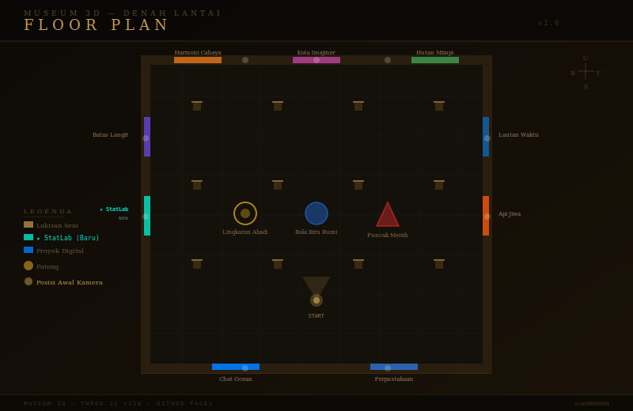

# 🏛️ Museum 3D

> Galeri seni digital interaktif berbasis Three.js — jelajahi pameran lukisan dan patung dalam ruang 3D langsung di browser.

<br>

## 📸 Preview

https://xian0000000.github.io/3d_museum/ <-- Deploy

### Denah Lantai (Floor Plan)



### Struktur Navigasi Museum

```
                        [ DINDING UTARA ]
          Harmoni Cahaya | Kota Imajiner | Hutan Mimpi

[ BARAT ]                  [ TENGAH ]                  [ TIMUR ]
Batas Langit          Lingkaran Abadi               Lautan Waktu
★ StatLab ←NEW        Bola Biru Bumi                Api Jiwa
                       Puncak Merah

                        [ DINDING SELATAN ]
                    Chat Ocean | Perpustakaan Kuno
```

---

## 🗂️ Struktur Folder

```
museum-3d/
│
├── index.html                  ← Entry point (HTML murni, tanpa inline JS/CSS)
│
├── css/
│   └── style.css               ← Semua styling terpisah
│
├── js/
│   ├── app.js                  ← Orkestrasi utama & game loop
│   │
│   ├── data/
│   │   └── exhibits.js         ← ✏️ Data pameran — edit di sini untuk tambah lukisan
│   │
│   ├── engine/
│   │   ├── TextureFactory.js   ← Generator tekstur canvas (lantai, dinding, lukisan, dll)
│   │   ├── Materials.js        ← Singleton material Three.js (cache)
│   │   ├── Museum.js           ← Geometri ruangan (dinding, lantai, langit, pilar)
│   │   ├── Lighting.js         ← Setup pencahayaan ambient + point lights
│   │   ├── Painting.js         ← Pembuatan bingkai lukisan 3D
│   │   └── Sculpture.js        ← Pembuatan patung di atas pedestal
│   │
│   └── ui/
│       ├── InfoPanel.js        ← Panel info pameran (muncul saat mendekat)
│       ├── DragControls.js     ← Kontrol kamera FPS (mouse/touch/keyboard)
│       └── LoadingScreen.js    ← Animasi layar muat
│
└── screenshots/
    └── floorplan.svg           ← Denah museum (dipakai di README)
```

> **Catatan:** File gambar opsional (`chatocean.png`, `perpuskuno.png`) diletakkan di root bersama `index.html`.

---

## ✨ Fitur

| Fitur | Keterangan |
|---|---|
| 🎨 **9 Lukisan** | 6 karya seni abstrak prosedural + 3 proyek digital |
| 🏺 **3 Patung** | Berputar otomatis di atas pedestal berkubah kaca |
| 🕹️ **Kontrol FPS** | WASD / Arrow + drag mouse, tanpa pointer lock |
| 📱 **Mobile Ready** | Tombol layar virtual + touch drag |
| ✨ **★ StatLab** | Panel statistik interaktif terintegrasi di museum |
| 🔗 **Deep Link** | Mendekati pameran proyek → panel info + tombol kunjungi |
| ⚡ **Zero Build** | Tidak butuh bundler — cukup buka `index.html` |

---

## 🚀 Cara Menjalankan

### Lokal (tanpa server)
```bash
# Clone repo
git clone https://github.com/xian0000000/museum-3d.git
cd museum-3d

# Buka di browser (butuh server karena ES Modules)
npx serve .
# atau
python -m http.server 8080
```

Buka `http://localhost:8080` di browser.

> ⚠️ **Wajib pakai server lokal** — file `js/app.js` menggunakan `type="module"` (ES Modules), yang tidak bisa dibuka langsung via `file://`.

### GitHub Pages
1. Push repo ke GitHub
2. Aktifkan **Settings → Pages → Branch: main / root**
3. Akses di `https://<username>.github.io/<repo-name>/`

---

## 🎮 Kontrol

| Input | Aksi |
|---|---|
| `W` / `↑` | Maju |
| `S` / `↓` | Mundur |
| `A` / `←` | Geser kiri |
| `D` / `→` | Geser kanan |
| **Drag Mouse** | Putar pandangan |
| **Touch Drag** | Putar pandangan (mobile) |
| **Tombol Layar** | Gerak (mobile) |

---

## ✏️ Cara Menambah Pameran

Semua data pameran ada di satu file: `js/data/exhibits.js`.

### Menambah Lukisan Biasa

```js
// Di js/data/exhibits.js — tambahkan di slot yang sesuai
{
  type: "painting",
  title: "Nama Karya",
  artist: "Nama Seniman",
  year: "2026",
  desc: "Deskripsi singkat karya ini.",
  colors: ["#hexwarna1", "#hexwarna2", "#hexwarna3"],
}
```

### Menambah Lukisan Proyek (dengan tombol link)

```js
{
  type: "painting",
  title: "Nama Proyek",
  artist: "Nama Kamu",
  year: "2026",
  desc: "Deskripsi proyek, ajak pengunjung klik tombol.",
  colors: ["#hexwarna1", "#hexwarna2"],
  url: "https://proyekkamu.com",
  isNamaProyek: true,   // flag unik untuk styling
}
```

Lalu tambahkan styling-nya di `js/ui/InfoPanel.js`:

```js
// Di objek EXHIBIT_STYLES
isNamaProyek: {
  tag: "Label Tag",
  borderColor: "#hexwarna",
  textColor: "#hexwarna",
  showLink: true,
},
```

### Menambah Patung Baru

```js
{
  type: "sculpture",
  title: "Nama Patung",
  artist: "Seniman",
  year: "2025",
  desc: "Deskripsi patung.",
  color: 0xRRGGBB,                          // warna hex Three.js
  shape: "torusKnot",                       // lihat tabel di bawah
}
```

**Shape yang tersedia:**

| Nilai `shape` | Bentuk |
|---|---|
| `torusKnot` | Simpul toroidal |
| `sphere` | Bola |
| `icosahedron` | Polyhedron 20 sisi |
| `torus` | Donat |

Untuk menambah bentuk baru, tambahkan entry di `GEOMETRIES` dalam `js/engine/Sculpture.js`.

### Menambah Tekstur Lukisan Kustom

Untuk lukisan dengan gambar PNG sendiri (seperti `chatocean.png`):

1. Letakkan file `.png` di root folder (sejajar `index.html`)
2. Tambahkan flag `isNamaKamu: true` di data exhibit
3. Tambahkan kondisi di `js/engine/Painting.js`:

```js
} else if (data.isNamaKamu) {
  paintingTex = new THREE.TextureLoader().load("gambar-kamu.png");
}
```

---

## 🔧 Troubleshooting

### Layar hitam / museum tidak muncul

| Kemungkinan Penyebab | Solusi |
|---|---|
| Dibuka via `file://` | Pakai server lokal (`npx serve .` atau `python -m http.server`) |
| CDN Three.js gagal dimuat | Cek koneksi internet; coba ganti ke r134 di `index.html` |
| Error di console browser | Buka DevTools (F12) → tab Console, perhatikan error merah |

### Gambar PNG tidak muncul (layar hitam pada bingkai)

- Pastikan file `.png` ada di folder root (sejajar `index.html`)
- Nama file harus sama persis (case-sensitive di Linux/macOS)
- Jika masih gagal, TextureFactory fallback canvas akan aktif otomatis

### Performa lambat / FPS rendah

- Kurangi `devicePixelRatio` di `_initRenderer()` dari `1.5` → `1.0`
- Kurangi jumlah PointLight di `Lighting.js`
- Turunkan resolusi tekstur di `TextureFactory.js` (ubah `512` → `256`)

### Panel info tidak muncul saat dekat lukisan

- Pastikan radius dalam `createPainting()` (`return { radius: 3.0, ... }`) cukup besar
- Periksa apakah `exhibit.position` sudah benar di `app.js`

---

## 🛠️ Teknologi

| Teknologi | Versi | Kegunaan |
|---|---|---|
| [Three.js](https://threejs.org/) | r128 | Rendering 3D WebGL |
| ES Modules | Native | Modularisasi tanpa bundler |
| Canvas 2D API | Native | Tekstur prosedural |
| HTML5 / CSS3 | Native | UI & HUD overlay |

---

## 📁 File Gambar Opsional

File PNG berikut bisa kamu letakkan di root folder untuk tampilan bingkai kustom.  
Jika tidak ada, sistem akan otomatis menggunakan tekstur canvas prosedural sebagai fallback.

| File | Dipakai Oleh |
|---|---|
| `chatocean.png` | Bingkai "Chat Ocean" |
| `perpuskuno.png` | Bingkai "Perpustakaan Kuno" |

---

## 🗺️ Roadmap

- [ ] Ruangan tambahan (pintu antar galeri)
- [ ] Efek particle debu / cahaya
- [ ] Audio ambient museum
- [ ] Mode gelap / terang UI panel
- [ ] Tambah pameran video (WebGL video texture)

---

## 📝 Lisensi

MIT — bebas digunakan, dimodifikasi, dan didistribusikan.

---

<p align="center">
  Dibuat dengan ❤️ menggunakan Three.js &nbsp;·&nbsp;
  <a href="https://xian0000000.github.io/statistic/">StatLab</a> &nbsp;·&nbsp;
  <a href="https://github.com/xian0000000">@xian0000000</a>
</p>
